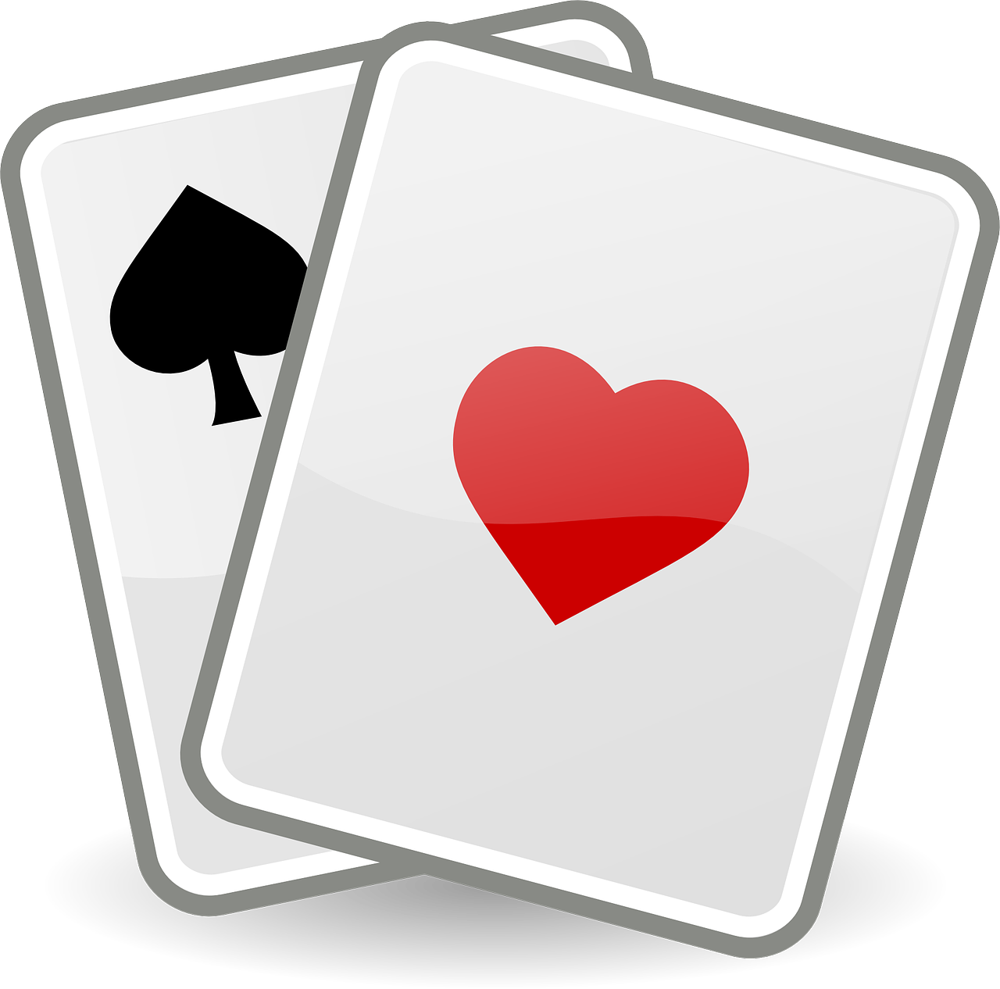
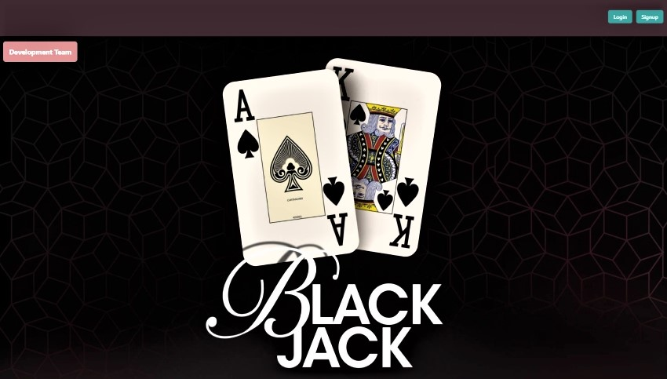

<h1 align="center">
  
   
  Mintbean Hackathon: Black Jack Game
</h1>

### Table of Contents

- [Introduction](#introduction)
- [Features](#features)
- [The Team](#the-team)
- [Screenshots](#screenshots)

## Introduction

This was a collaborative project implemented for the Mintbean's Hackathon 2021.  The project was to implement a full stack web application to allow users to play a game of black jack against an AI.  

### Built With

- Node
- Express
- React
- MongoDB

## Features

- Create an account to keep track of game won
- Play a game against an AI
- Display a leader board of the top 10 players

## The Team

- Jairo Calderon - [@linkedln](https://www.linkedin.com/in/jairo-calderon-44512ba5/)
- Maira Garcia - [@linkedln](https://www.linkedin.com/in/mairagarcia524/)
- Nhu Phan - [@linkedln](https://www.linkedin.com/in/nhu-phan-canada/)

## Screenshots

